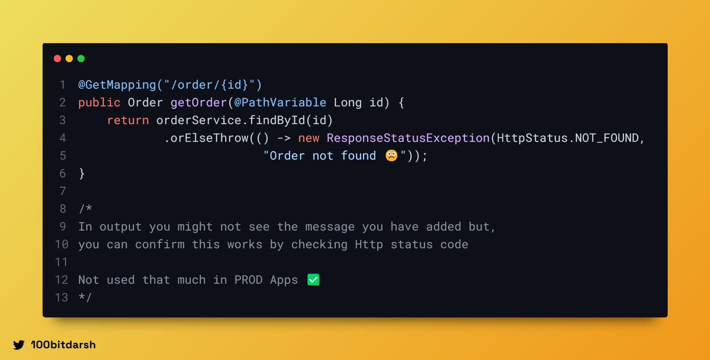

# Introduction

While developing any application, it is crucial to ensure fault tolerance to handle unexpected scenarios gracefully.
In Spring and Spring Boot, exception handling is one of the key techniques to achieve fault tolerance.
Proper exception handling prevents application crashes, enhances debugging, and improves user experience.

In this readme, I will guide you through various ways to handle exceptions globally in a Spring Boot application,
including using `@ExceptionHandler` , `@ControllerAdvice`, and `ResponseStatusException`.

## Why is Exception Handling Important?

- **Improves user experience:** Prevents users from seeing raw error messages.
- **Enhances maintainability:** Helps developers diagnose and debug issues.
- **Ensures stability:** Prevents application crashes due to unhandled exceptions.

### 1. Using @ExceptionHandler

The `@ExceptionHandler` annotation is used to handle specific exceptions within a single controller.

**Explanation:**
- The getUserById method fetches a user and throws UserNotFoundException if not found.
- The @ExceptionHandler method catches this exception and returns a meaningful response.

### 2. Using @RestControllerAdvice for Global Exception Handling (Mostly used in Production ⭐)

Instead of handling exceptions in individual controllers, `@RestControllerAdvice` allows centralized exception handling
across the entire application.

**Explanation:**

- `@RestControllerAdvice` is used to define a global exception handler.
  It catches `UserNotFoundException` and returns a 404 NOT FOUND status.
- A generic handler catches all unhandled exceptions, returning 500 INTERNAL SERVER ERROR.
  If you want to return any custom error response for a particular exception, you can do so by creating a custom error
  class and returning that object as a response instead of a simple string. Below is an example of returning a custom
  error response.
  

Returning custom error response for specific exception
**Explanation:**

- Instead of returning just a message, we now return a structured JSON response with additional metadata like an status
  code, message etc.
- The ErrorResponse class encapsulates error details, making error responses more informative.

### 3. Using ResponseStatusException
Spring Boot provides ResponseStatusException, which allows throwing exceptions with an HTTP status directly.

## Conclusion
Spring Boot provides multiple mechanisms to handle exceptions efficiently, including:

- `@ExceptionHandler` for controller-level handling.
- `@RestControllerAdvice` for centralized exception management.
- `ResponseStatusException` for concise exception throwing.
Using these techniques ensures better error handling, improved user experience, and easier debugging.

**Happy Coding! 🚀**